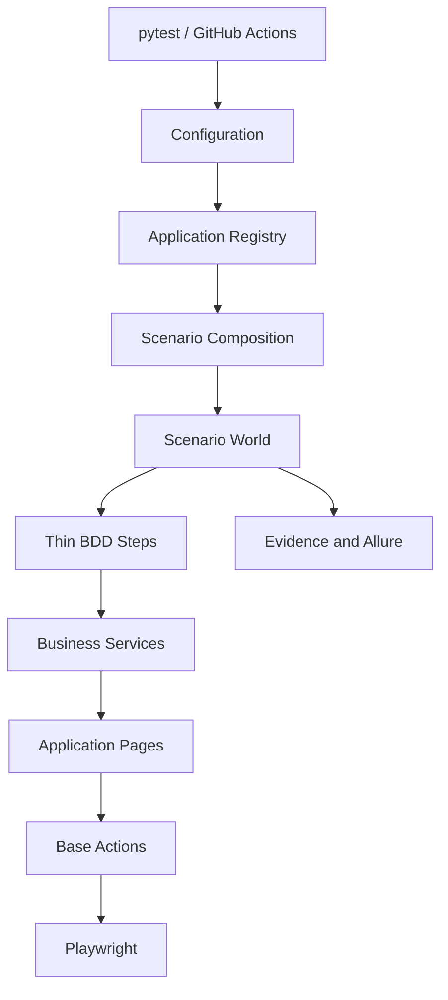

# Architecture

## Dependency direction

Core owns contracts and infrastructure. Applications provide manifests and implementations. Core does not import application modules, and applications do not import each other.

## Scenario lifecycle

1. `pytest` loads validated settings.
2. A scenario creates its own `ScenarioContext` and browser context.
3. The registry resolves the selected application manifest.
4. Steps invoke a business service through the context.
5. Pages use `BaseActions`; selectors remain in locator modules.
6. Failure hooks capture screenshot, video, trace, and logs according to policy.
7. `finally` closes page/context and flushes reporting.

## Authentication

The `AuthenticationManager` checks an environment/user scoped storage-state file and its expiry. If absent or expired, an injected provider authenticates and writes a file under the ignored reports area. Credentials are supplied by environment variables or a secret provider and are masked by the logger.

## Retry ownership

pytest owns scenario retry at the CI boundary. Functional assertions are not retried. Infrastructure failures can be classified by the failure classifier and retried by an explicitly configured runner policy; there is no nested blind retry loop.

## Production boundaries

Email, database history, cloud execution, and external test management are interfaces with configuration-driven adapters. The platform fails clearly when a required provider is not configured rather than reporting a fake success.
